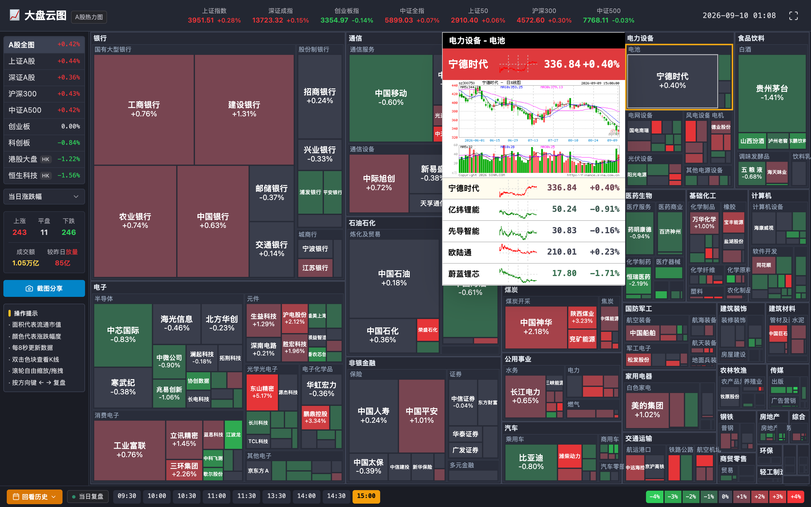

# Stock Market Cloud 📈☁️

<p align="center">
  
</p>

[中文版](#中文版) | [English](#english)

---

<a name="中文版"></a>
## 🇨🇳 中文版

> 一个基于 React、TypeScript、Tailwind CSS 和 D3 构建的三市场股票热力云图看盘面板，覆盖 A 股、港股和美股。

**线上体验:** [https://stock.wenyaoyefei.com/](https://stock.wenyaoyefei.com/)

“股票行情云图”是一个高度复刻专业看盘终端体验的股票热力图工具：支持实时热力分布、板块轮动监测、成分股智能吸附全景卡片与历史时段复盘。

### 项目简介

- **三市场统一看盘**：A 股、港股、美股集中在一个面板里切换查看
- **高保真交互与视觉**：细分行业金色高亮吸附与 324px 行业全景悬浮面板（包含东财实时分时图与新浪日 K 线大图）
- **热力图优先的信息结构**：按板块与细分行业双层聚合的市值热力图，适合快速扫盘
- **符合中文市场习惯的涨跌语义**：所有涨跌直接相关的视图与卡片采用 9 级红涨绿跌色阶
- **本地免费数据后端**：支持本地缓存与扩展股票池，更适合持续开发和自用部署

### ✨ 核心功能

- **细分行业金色高亮吸附**：鼠标划过任意个股或行业时，该细分行业自动高亮金色描边并智能就近吸附透视面板。
- **324px 行业全景悬浮面板**：集成东方财富分时微图、新浪日 K 线、成分股列表与实时红绿价格变色。
- **面板移入联动与双击雪球**：鼠标滑入面板可直接浏览成分股，滑动列表联动切换日 K 预览，双击直达雪球官方个股主页。
- **历史分时回放与复盘日历**：支持按交易日分时段回放历史行情切片。
- **自动刷新行情面板**：每 8-10 秒刷新一次行情，状态区带有环形倒计时进度。
- **A 股 / 港股 / 美股切换**：支持在三大市场之间一键切换，并记住上次选择。
- **板块加权涨跌表现**：板块标题直接显示按市值加权后的平均涨跌幅，方便快速判断强弱。
- **盘面高清截图分享**：一键生成带水印的大盘云图快照，支持直接复制或下载图片。

### 🛠️ 技术栈
- **核心框架**：React 18, TypeScript, Vite
- **样式方案**：Tailwind CSS (充分运用了现代原子类及渐变背景)
- **数据可视化**：D3-Hierarchy (`d3-treemap`, `squarify` 算法), 自定义 SVG 路径生成器
- **测试框架**：Vitest, JSDOM, Playwright 浏览器端 E2E 测试

### 🚀 快速启动

1. 克隆项目到本地：
   ```bash
   git clone git@github.com:FisherWenray/stock-market-cloud.git
   cd stock-market-cloud
   ```

2. 安装依赖并启动前端开发服务器：
   ```bash
   npm install
   npm run dev
   ```

3. 在浏览器中打开 `http://localhost:5173`。

4. 如果你希望同时启用本地行情后端，再开一个终端运行：
   ```bash
   npm run dev:market
   ```

### 免费行情后端 V1

这个项目支持一个轻量级本地后端：它会定时刷新免费行情数据、把结果缓存到磁盘，并让前端通过 `/api/market` 读取整理后的数据。

双终端启动方式：

```bash
npm run dev:market
npm run dev
```

常用环境变量：

```bash
MARKET_SERVER_PORT=8787
MARKET_REFRESH_MS=300000
MARKET_UNIVERSE_REFRESH_MS=43200000
MARKET_MAX_STOCKS=1500
MARKET_HK_FULL_SCAN=true
VITE_MARKET_LIMIT=1500
VITE_USE_MARKET_BACKEND=true
```

V1 数据说明：

- 美股股票池来自 Nasdaq Trader 的目录文件刷新
- 港股默认扫描 `00001.HK` 到 `09999.HK` 并保留有效行情代码
- A 股目前以内置股票池和 fallback 路径为主，保证稳定性
- 行情通过腾讯免费接口抓取，并缓存到 `.market-cache`
- 若本地后端未启动，前端会回退到浏览器侧抓取路径
- 免费数据源可能有延迟、限流、缺失或不可用，更适合个人看盘与自用部署，不适合作为严格实时行情基础设施

### 🧪 测试运行

* 运行单元与组件测试：
  ```bash
  npm run test:run
  ```
* 运行 Playwright 浏览器端 E2E 整体功能测试：
  ```bash
  npm run test:e2e
  ```

---

<a name="english"></a>
## 🇺🇸 English

> A real-time stock market treemap dashboard for US, Hong Kong, and A-share equities, built with React, TypeScript, Tailwind CSS, and D3.

<p align="center">
  
</p>

**Live Demo:** [https://stock.wenyaoyefei.com/](https://stock.wenyaoyefei.com/)

Stock Market Cloud is a market-screen style heatmap tool for tracking **A-share**, **Hong Kong**, and **US** equities with high fidelity: real-time treemap distribution, dynamic subsector border snapping, 324px overview panels with Sina K-lines and Eastmoney intraday sparklines, and historical timeline replay.

### Project Summary

- **Three-market coverage**: A-share, Hong Kong, and US market views in one dashboard
- **High-fidelity interaction**: Dynamic yellow subsector border highlight with 324px adjacent docking overview panels
- **Treemap-first workflow**: Two-tier sector and subsector aggregated market cap heatmap for fast visual scanning
- **Chinese market semantics**: Standard 9-step red up and green down palette across all views
- **Local free-data backend**: Optional cached backend for larger symbol universes and more stable local development

### ✨ Key Features

- **Dynamic Golden Subsector Snapping**: Moving cursor over any stock or industry highlights the subsector with a 2.5px golden border and auto-docks the overview panel adjacent to it.
- **324px Industry Overview Panel**: Integrates Eastmoney intraday mini sparklines, Sina daily K-line charts, and real-time color-coded component stock lists.
- **Interactive List Hover & Xueqiu Drill-in**: Hovering rows inside the panel updates the live K-line preview; double-clicking opens official Xueqiu quote pages.
- **Historical Replay & Calendar**: Step through trading day time slots with historical breadth and performance snapshots.
- **Auto-refresh market dashboard**: Refreshes quotes on an 8-second cadence with circular countdown progress.
- **HD Canvas Screenshot**: One-click branded snapshot generation with clipboard copy and PNG download.

### 🛠️ Tech Stack
- **Core**: React 18, TypeScript, Vite
- **Styling**: Tailwind CSS
- **Data Visualization**: D3-Hierarchy (`d3-treemap`, `squarify`), SVG Area Generators
- **Testing**: Vitest, JSDOM, Playwright E2E

### 🚀 Getting Started

1. Clone the repository:
   ```bash
   git clone git@github.com:FisherWenray/stock-market-cloud.git
   cd stock-market-cloud
   ```

2. Install dependencies and run the frontend:
   ```bash
   npm install
   npm run dev
   ```

3. Open `http://localhost:5173`.

4. For the optional local market backend, run this in another terminal:
   ```bash
   npm run dev:market
   ```

### 🧪 Running Tests

* Run unit and component tests:
  ```bash
  npm run test:run
  ```
* Run End-to-End browser specs:
  ```bash
  npm run test:e2e
  ```

### Free Market Backend V1

This project can run a lightweight local backend that refreshes free market data once, caches it on disk, and lets the React app read `/api/market` instead of asking every browser tab to call quote providers directly.

Run the backend and frontend in two terminals:

```bash
npm run dev:market
npm run dev
```

Useful environment variables:

```bash
MARKET_SERVER_PORT=8787
MARKET_REFRESH_MS=300000
MARKET_UNIVERSE_REFRESH_MS=43200000
MARKET_MAX_STOCKS=1500
MARKET_HK_FULL_SCAN=true
VITE_MARKET_LIMIT=1500
VITE_USE_MARKET_BACKEND=true
```

V1 data behavior:

- US universe is refreshed from Nasdaq Trader symbol directory files.
- HK universe defaults to scanning `00001.HK` through `09999.HK` and keeps symbols that return valid quotes.
- CN market currently prioritizes the bundled A-share dataset and fallback flow for reliability.
- Quotes are fetched through Tencent's free quote endpoint and cached in `.market-cache`.
- The frontend falls back to the previous client-side fetch path if the backend is not running.
- Free data sources are best-effort and may be delayed, rate-limited, incomplete, or unavailable. This is suitable for a personal/free delayed heatmap, not a guaranteed real-time market-data service.

## 📝 License
This project is open-sourced under the MIT License.
